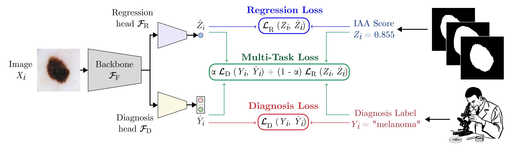

# Inter-Annotator Variability in Skin Lesion Segmentation
<!-- Ruff badge -->
<!-- arXiv badge -->
[](https://github.com/astral-sh/ruff) [](https://arxiv.org/abs/2508.09381)




This repository contains the official PyTorch implementation for the paper: "**What Can We Learn from Inter-Annotator Variability in Skin Lesion Segmentation?**", accepted for presentation at the [10th ISIC Skin Image Analysis Workshop](https://workshop.isic-archive.com/2025/), [MICCAI 2025](https://conferences.miccai.org/2025/en/).

In this work, we explore the relationship between inter-annotator agreement (IAA) in skin lesion segmentation and lesion malignancy. We find that malignant lesions are associated with significantly lower agreement among annotators. Leveraging this insight, we show that IAA can be accurately predicted directly from dermoscopic images. Finally, we introduce a multi-task learning model that jointly predicts diagnosis and IAA, achieving a notable improvement in diagnostic accuracy across five datasets.

## Key Contributions

- **A New Dataset**: We introduce **IMA++**, the largest publicly available multi-annotator skin lesion segmentation dataset, with 5,111 segmentations from 15 unique annotators across 2,394 images (**coming soon**).

- **IAA-Malignacy Association**: We provide a formal investigation demonstrating a statistically significant association between lower inter-annotator agreement (IAA), as measured by the average pairwise Dice similarity coefficient, and lesion malignancy.

- **Direct IAA Prediction**: We show that IAA scores can be predicted directly from image content with low error (MAE = 0.108)

- **Improved Diagnosis Prediction with MTL**: We demonstrate that using IAA prediction as an auxiliary task in a multi-task learning (MTL) framework consistently improves diagnostic performance over single-task models, including on single-annotator datasets: PH2, derm7pt, ISIC 2018, and ISIC 2019.


# Code

Training and evaluation code and model weights will be made available soon.

# IMA++ Dataset

Coming soon.

# Citation

If you find this work useful, please cite our paper:

```bibtex
@article{abhishek2025what,
  title={What Can We Learn from Inter-Annotator Variability in Skin Lesion Segmentation?},
  author={Abhishek, Kumar and Kawahara, Jeremy and Hamarneh, Ghassan},
  booktitle={Medical Image Computing and Computer-Assisted Intervention (MICCAI) ISIC Skin Image Analysis Workshop (MICCAI ISIC)},
  howpublished={https://arxiv.org/abs/2508.09381},
  year={2025}
}
```